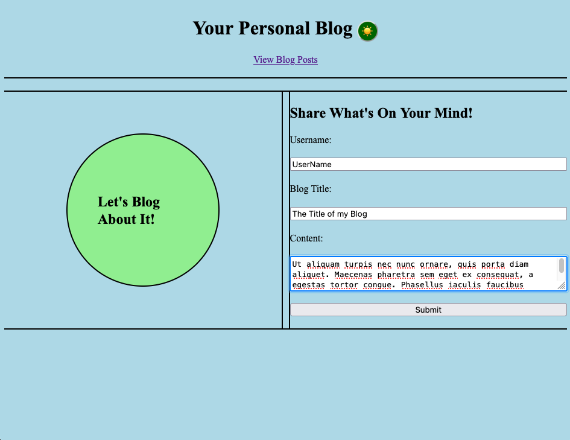
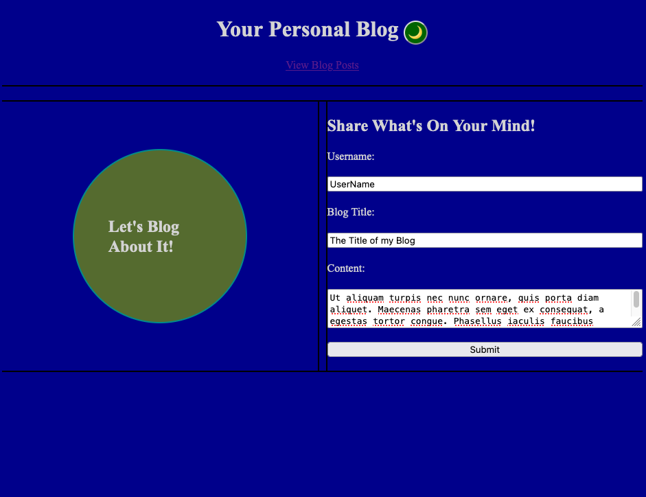
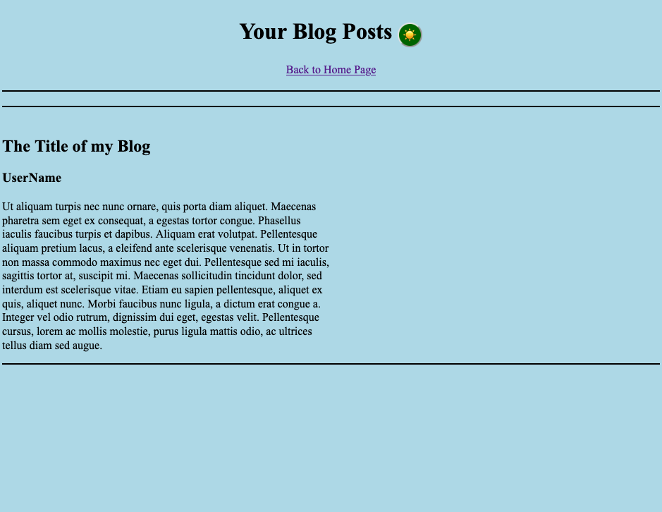
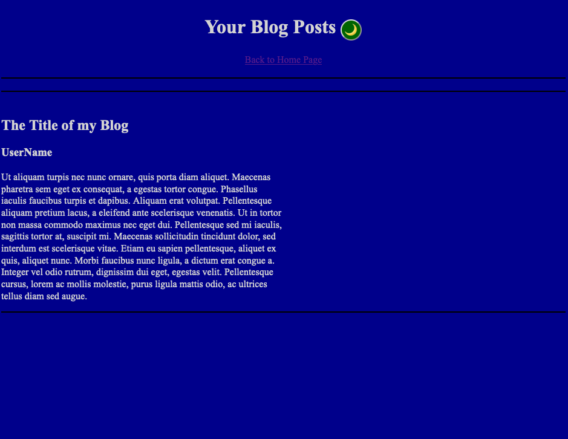

# C4-Personal-Blog

## Project Description

## Features

## Usage

### Submitting a Blog post

1. Open
2. Fill out form with your Username, Blog Title, and Content.
3. Click the "Submit" button.
4. You will be redirected to blog.html to view your submitted post

### Viewing Blog Posts

### Toggle Light/Dark Mode

## Deployed Page

[Deployed GitHub Page]()

## Source Code

- Created by [Lixiviate](https://github.com/Lixiviate)
- Assistance from [edX Xpert Learning Assistant](https://www.edx.org/)
